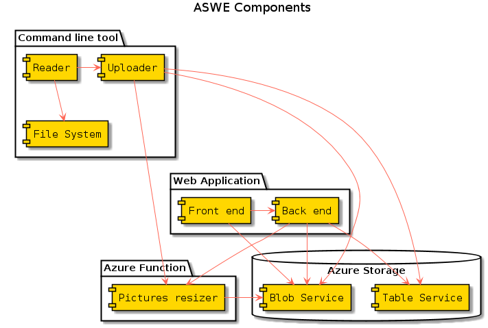

I used to store my family pictures and videos in Google Photos. Since I have two small children and we are in 2018, I rapidly ran out of the free space that Google offers to store original, full size, pictures. I decided to create my own media storage using Azure services, for a few reasons:

1. I love to code in my free time
1. I knew how to do it, but I could still practice and learn new things
1. Google Photos offers unlimited storage for resized pictures, but I want to store original pictures
1. Using [Azure Storage](https://azure.microsoft.com/en-us/services/storage/), I forget about space problems.
1. I have monthly credit from my [MSDN Enterprise subscription](https://azure.microsoft.com/en-us/offers/ms-azr-0063p/) to spend in Azure, so it looks silly to pay Google for extra space

I built a system from the ground up, having all the features I desired most, including the possibility to share my family pictures with my relatives, while keeping my files private. 

This blog post describes this project, which I provisionally called **ASWE** _(Azure Storage Web Explorer)_, with several videos I uploaded in [YouTube](https://www.youtube.com/channel/UCRM6SkXIC5WUavo3luSDNlQ?view_as=subscriber).

## Components

* Web front end consisting of a single page application to handle albums, files, sharing, with a rich pictures gallery, possibility to play music and videos
* Web back end consisting of an api
* Command line application to bulk upload files from local file system into Azure Blob Service, recreating the same folder structure with metadata to Table Service
* Azure Function to produce pictures optimized for the web (thumbnails and medium size pictures)
* Azure Application Insights service, to collect telemetry data from the web application

# Features

## Login
The application currently implements custom made authentication strategy. Login is protected against brute-forcing, passwords are stored using [Argon2](https://en.wikipedia.org/wiki/Argon2) hashing, the application issues its own JWT upon login, implements refresh tokens. This is a temporary solution: in the future the application will be integrated with [Azure Active Directory B2C](https://azure.microsoft.com/en-us/services/active-directory-b2c/). By the way, I had occasion to use and familiarize with Azure B2C recently at work.

<iframe width="760" height="440" src="https://www.youtube.com/embed/6Ke9-YQvMHg" frameborder="0" allowfullscreen></iframe>

## Creating albums
Each album corresponds to a private container in the Blob Service, so uploaded files are _private_ in the cloud. Since Azure Storage takes care of storing files in several copies, the risk of losing data is really little. If the cheapest LRS (_Locally Redundant Storage_) is used, each file stored in three copies in the same Azure data center, this can be changed as desired when handling the instance of Azure Storage. For example, with GRS (_Geographically Redundant Storage_), files are stored in three copies in the main data center and other three copies in a data center in a different geographical location.

<iframe width="760" height="440" src="https://www.youtube.com/embed/bb5JpJIB4kE" frameborder="0" allowfullscreen></iframe>

## Uploading pictures using the web interface
The web interface supports chunked upload of multiple files simultaneously, with progress bars and previews (using HTML5 Canvas for pictures). Any kind of file can be uploaded using the web interface, but pictures are handled in a special way: they are first uploaded in original size directly to Blob Service, then a dedicated Azure Function prepares pictures optimized for the web: thumbnails and medium size pictures. Pictures are automatically rotated analyzing their EXIF metadata, EXIF metadata is removed from pictures optimized for the web, kept for original pictures. Additional picture information such as original size is returned to web client, stored in Table Service and used by front end to implement a rich pictures gallery.

<iframe width="760" height="440" src="https://www.youtube.com/embed/eU0x_I-ZdZg" frameborder="0" allowfullscreen></iframe>

## Creating virtual folders
The web application supports navigable file system-like virtual folders.

<iframe width="760" height="440" src="https://www.youtube.com/embed/xkwhnIzQ8dw" frameborder="0" allowfullscreen></iframe>

Sub folders are supported as well: navigable bread crumbs make it easy to move through folders.

<iframe width="760" height="440" src="https://www.youtube.com/embed/JjGL_jp3-Kg" frameborder="0" allowfullscreen></iframe>

## Navigating inside folder
The web application currently implements two kinds of views: table and gallery and supports toggling preview mode, which affects picture thumbnails, audio and video files. The application implements pagination: files are returned from server in groups, new files are downloaded automatically when scrolling to the bottom of the list.

<iframe width="760" height="440" src="https://www.youtube.com/embed/9UY2WzdGnDE" frameborder="0" allowfullscreen></iframe>

## Moving files to virtual folders
Files and folders can be moved rapidly inside the same album, across virtual folders. They can also be moved to different albums (containers in the storage), but in this case the operation is slower because it requires moving blobs. Of course, folders are moved with all their descendants nodes.

<iframe width="760" height="440" src="https://www.youtube.com/embed/TyBppDnnxhg" frameborder="0" allowfullscreen></iframe>

## Deleting folders
Files and folders can be deleted. Files metadata are deleted together with their blobs (actual file bytes). When folders are deleted, all their descendants are deleted as well.

<iframe width="760" height="440" src="https://www.youtube.com/embed/AntJEVy7LaM" frameborder="0" allowfullscreen></iframe>

## Uploading audio and video
Audio and video files can be played directly from the web interface. HTML5 video and audio elements take care of streaming of contents as they become necessary.

<iframe width="760" height="440" src="https://www.youtube.com/embed/FN_mY7Yytvc" frameborder="0" allowfullscreen></iframe>

## Sharing albums
Albums can be shared with other users; currently read only access is implemented for shared albums, but in the future writer and co-owner access levels will be implemented.

<iframe width="760" height="440" src="https://www.youtube.com/embed/DIHKy0WRJEU" frameborder="0" allowfullscreen></iframe>

Once an album is shared, it becomes visible and accessible in read only for another application user. _Shared access signatures_ for read only access are generated on the fly, only for authorized users.

Sharing can be removed. Currently only album owners can control sharing.

<iframe width="760" height="440" src="https://www.youtube.com/embed/zpj9H3k42G8" frameborder="0" allowfullscreen></iframe>

## Uploading using client
I wrote a client uploader, that lets upload files from local file system into the application. Files can be uploaded recursively and the local folders structure is recreated in virtual nodes inside the web application. The client uploader uses asynchronous web requests to optimize upload speed.

As it happens for the web upload, pictures are uploaded in original size and resized pictures optimized for the web are prepared by a dedicated Azure Function (the same used by web client).

I already uploaded about 70GB of family pictures and videos, using my client uploader. Files are uploaded in chunks, files of any size supported by Azure Storage can be uploaded (maximum size depends on chunk size).

<iframe width="760" height="440" src="https://www.youtube.com/embed/ZtZXJTWE73I" frameborder="0" allowfullscreen></iframe>

## Validation of fields
The web client on the front end is a single page application implemented using [Vue.js](https://vuejs.org). Forms validation on the client side is implemented using a library I wrote, [DataEntry](https://github.com/RobertoPrevato/DataEntry).

<iframe width="760" height="440" src="https://www.youtube.com/embed/HAOUkXgB9Io" frameborder="0" allowfullscreen></iframe>

## Deleting albums
The web application implements deleting albums (whole virtual structure and container in Blob Service).

<iframe width="760" height="440" src="https://www.youtube.com/embed/YgkQATE8qSc" frameborder="0" allowfullscreen></iframe>

# Next improvements
* integration with Azure Active Directory B2C, like described previously
* support for HEIC files
* support for comments

# Conclusions
Get in touch or leave a comment if you found this interesting! I hope to find someone interested in working on this project with me, since I see the possibility to sell it as service or product.